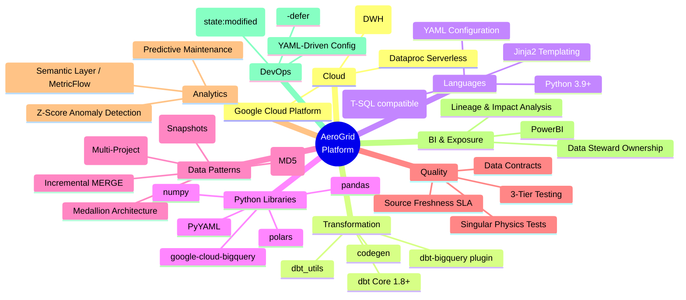
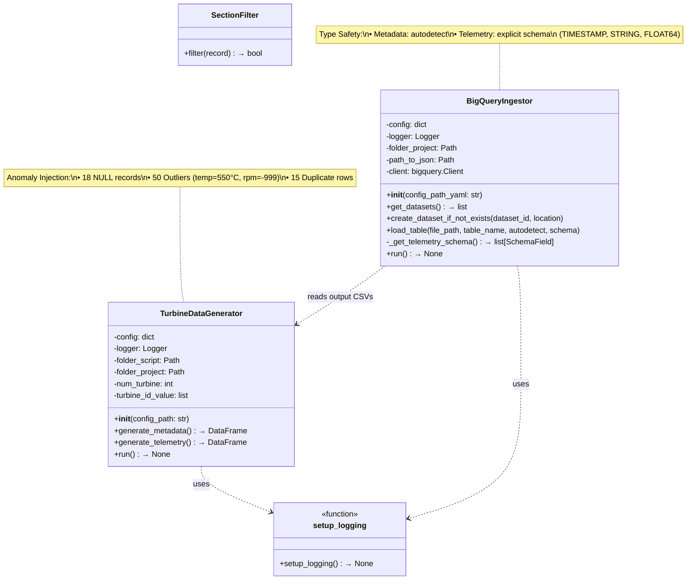
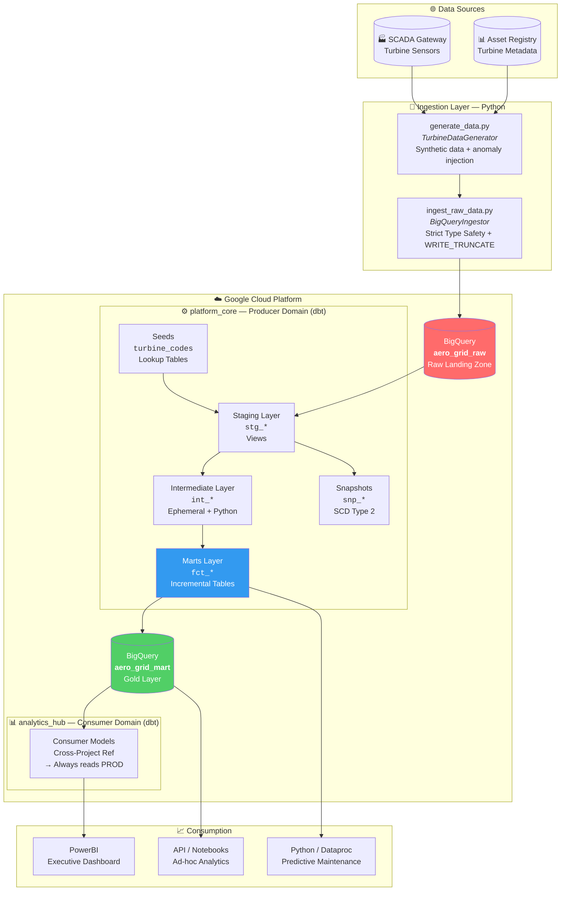
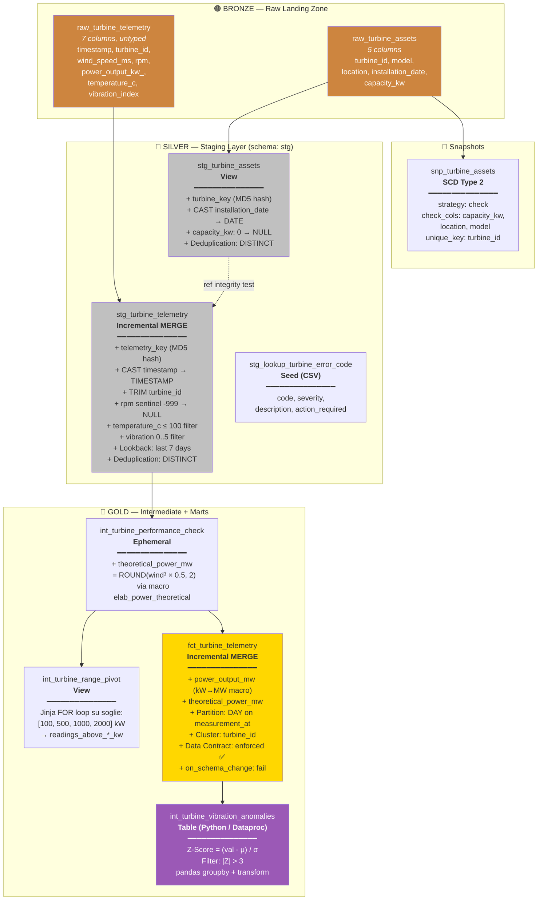
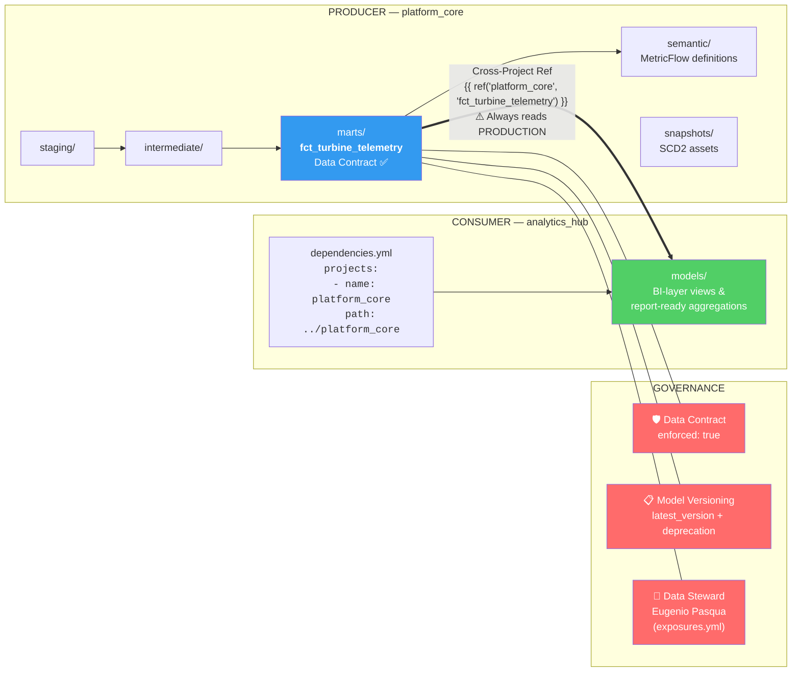

 
# 🌬️ AeroGrid Platform: Enterprise IoT Data Architecture

<p align="center">
  
  
  
  
  
  
</p>

**AeroGrid Platform** è un'infrastruttura dati Enterprise end-to-end progettata per l'ingestion, l'elaborazione e l'analisi avanzata di dati telemetrici IoT provenienti da una flotta di turbine eoliche. 

Sviluppato per simulare scenari reali ad alta intensità di dati (tipici del settore Energy/Aerospace), il progetto trasforma terabyte di rilevazioni grezze e non strutturate in Data Products certificati, pronti per la Business Intelligence e algoritmi di Predictive Maintenance.


---

## 🎯 Executive Summary & Valore di Business
Il progetto affronta e risolve le sfide critiche dell'ingegneria dei dati moderna per scenari ad alta intensità, posizionandosi come una soluzione "Enterprise-Ready". L'architettura implementa le best practice e gli standard ufficiali dbt Labs, strutturandosi su 4 pilastri strategici:

### 🏛️ 1. Architettura e Governance
* **Data Mesh & Domain-Driven Design (Multi-Project):** Suddivisione in due progetti dbt distinti e interdipendenti per evitare colli di bottiglia organizzativi. `platform_core` (Producer) è gestito dal team Data Engineering per le trasformazioni core; `analytics_hub` (Consumer) è dedicato alla BI. Una macro custom forza l'ambiente consumer a interrogare sempre la produzione reale, garantendo il disaccoppiamento senza duplicazione dei dati.
* **Architettura Medallion & Time Spine:** Strutturazione rigorosa in layer Staging (normalizzazione), Intermediate (logiche di business) e Marts (Gold Layer). Include l'implementazione di una Time Spine ininterrotta (2020-2030) vitale per gestire i tipici "buchi" di trasmissione dell'IoT e supportare aggregazioni temporali perfette.

### 🛡️ 2. Resilienza e Data Quality Industriale
* **Gestione 'Late Arriving Data' (Self-Healing):** Gestione automatica dei ritardi di rete IoT tramite pattern di UPSERT. I modelli incrementali sfruttano la strategia merge e chiavi Hash MD5 (surrogate keys) per accodare i nuovi pacchetti e sovrascrivere eventuali ritrasmissioni, annullando il rischio di duplicati.
* **Data Contracts & Model Versioning:** Il data product principale è blindato da rigidi Data Contracts (`enforced: true`) che impediscono modifiche distruttive allo schema. Le evoluzioni sono gestite tramite Model Versioning nativo, mantenendo le vecchie versioni operative (con `deprecation_date`) per garantire migrazioni a zero-downtime per i team a valle.
* **Quality Assurance a 3 Livelli & Fisica dei Dati:** Oltre ai test relazionali e ai limiti parametrici, il progetto implementa Singular Tests SQL che validano vere e proprie leggi fisiche industriali (es. impossibilità di generare energia in assenza di vento), isolando immediatamente anomalie hardware sfuggite ai sensori.
* **Source Freshness & SLA Monitoring:** Controlli rigorosi sulle fonti grezze per monitorare la latenza. In ambito eolico, intercettare oltre 24h di mancata trasmissione trasforma la pipeline dati in un sistema di allerta operativa precoce contro guasti ai gateway SCADA.

### 💡 3. Advanced Analytics & Astrazione
* **Polyglot Transformation (dbt-Python per Manutenzione Predittiva):** I calcoli procedurali statistici complessi non vengono forzati in SQL. Il progetto esegue nativamente nel DWH modelli Python (pandas via Dataproc) per l'individuazione di anomalie vibrazionali tramite Z-Score, fornendo dati pronti per interventi di manutenzione predittiva.
* **Semantic Layer & MetricFlow:** Astrazione totale delle logiche di business dal codice fisico. I KPI (come la Potenza Media per Turbina, calcolata dinamicamente come ratio) sono definiti centralmente in YAML, creando una vera "Single Source of Truth" interrogabile da qualsiasi tool BI.
* **Data Lineage Esteso & Exposures:** Il Lineage Graph (DAG) si estende oltre il DWH fino ai tool applicativi (es. dashboard direzionali PowerBI), abilitando una Impact Analysis istantanea e indicando chiaramente l'ownership dei Data Steward.

### ⚙️ 4. Scalabilità ed Efficienza (FinOps & DevOps)
* **Ottimizzazione Costi BigQuery (FinOps):** Architettura progettata per abbattere i costi di I/O. L'uso combinato di partizionamento temporale (`partition_by`), clustering, modelli incrementali e filtri dinamici di lookback in staging azzera i "full-table scan", massimizzando il Partition Pruning.
* **Storicizzazione Asset (SCD Type 2):** Tracciamento automatico del ciclo di vita fisico dell'hardware tramite i dbt Snapshots. Spostamenti o revamping delle turbine non alterano retroattivamente i KPI passati, garantendo un audit trail energetico immutabile.
* **Metaprogrammazione Jinja (DRY):** Utilizzo di macro e costrutti for-loop dinamici per automatizzare aggregazioni complesse (come i range di potenza pivotati), riducendo drasticamente il debito tecnico e accelerando il time-to-market di nuove feature.
* **DevOps, Slim CI & Deferral:** Pipeline ottimizzate che sfruttano il confronto di stato (`manifest.json`) e il deferral (`--defer`) per elaborare e testare esclusivamente i modelli modificati durante le Pull Request, importando i nodi genitore dalla produzione per una CI velocissima ed economica.

---

## 🧰 Technology Stack Summary



---

## 🏗️ Architettura e Stack Tecnologico
L'architettura si divide in tre macro-moduli, separati fisicamente per supportare pipeline CI/CD indipendenti:

* **Python Data Ingestion (`data_ops_ingestion`):** Modulo ad oggetti per la simulazione e l'ingestion dei dati sensoriali. Implementa logiche di Strict Type Safety verso BigQuery e inietta volontariamente anomalie (valori nulli, outlier termici) per testare la resilienza della pipeline a valle.



* **Producer Domain (`platform_core`):** Progetto dbt Core dedicato al Data Engineering puro. Mappa le fonti, sanifica i dati, storicizza le anagrafiche (SCD2) e applica complessi modelli fisico-matematici.
* **Consumer Domain (`analytics_hub`):** Progetto dbt Core per la Business Intelligence. Importa i dati dal layer core tramite le logiche di Cross-Project References tipiche del Data Mesh, ignorando gli ambienti di dev e puntando direttamente alla produzione.

### 🏗️ High-Level Focus Architettura




### 🥇 Medallion Architecture — Layer Detail



### 🔄 Data Flow — End-to-End Pipeline

```mermaid
flowchart LR
    subgraph "1. GENERATE"
        A["🎲 Synthetic Data<br/>15 turbine × 1000 readings<br/>+ 18 NULLs<br/>+ 50 Outliers<br/>+ 15 Duplicates"]
    end

    subgraph "2. INGEST"
        B["📤 BigQuery Load<br/>WRITE_TRUNCATE<br/>Strict Schema for Telemetry<br/>Autodetect for Metadata"]
    end

    subgraph "3. STAGE"
        C["🧹 Cleansing<br/>CAST types<br/>TRIM strings<br/>NULL sentinels → NULL<br/>Surrogate Keys (MD5)<br/>Deduplication<br/>Lookback Filter (7 days)"]
    end

    subgraph "4. INTERMEDIATE"
        D["🔬 Enrichment<br/>Theoretical Power (Jinja UDF)<br/>Vibration Z-Score (Python)<br/>Range Pivot (Jinja loop)"]
    end

    subgraph "5. MART"
        E["🏆 Gold Layer<br/>Incremental MERGE<br/>Partition by DAY<br/>Cluster by turbine_id<br/>Data Contract enforced"]
    end

    subgraph "6. CONSUME"
        F["📊 BI & ML<br/>PowerBI Dashboard<br/>Anomaly Alerts<br/>Predictive Maintenance"]
    end

    A -->|CSV files| B
    B -->|aero_grid_raw| C
    C -->|Views| D
    D -->|Ephemeral| E
    E -->|Tables| F

    style A fill:#ffe066,color:#333
    style B fill:#ffa94d,color:#333
    style C fill:#ff8787,color:#fff
    style D fill:#da77f2,color:#fff
    style E fill:#51cf66,color:#fff
    style F fill:#339af0,color:#fff

```



### 🔀 Data Mesh — Multi-Project Topology




---

## ✨ Enterprise Features Implementate
Questo repository è stato sviluppato seguendo rigorosamente gli standard ufficiali di dbt Labs e validato tramite il pacchetto `dbt_project_evaluator`.

* 🛡️ **Data Contracts & Versioning:** La fact table principale è blindata tramite contract: `enforced: true`. Evoluzioni strutturali sono gestite tramite `latest_version` e politiche di deprecazione programmate, garantendo zero disservizi per gli analisti BI.
* 🐍 **Polyglot Data Transformation (dbt-Python):** I calcoli procedurali complessi (come lo Z-Score per la rilevazione delle anomalie vibrazionali) non sono forzati in SQL, ma eseguiti nativamente nel DWH sfruttando modelli Python integrati nel DAG (via Dataproc Serverless).
* ⚙️ **Slim CI & Deferral:** Predisposizione per l'automazione DevOps tramite i flag `--state` e `--defer`, processando in CI solo il codice alterato durante le Pull Request, importando i nodi genitore direttamente dalla produzione.
* 📏 **Semantic Layer (MetricFlow):** Astrazione delle logiche aggregative dal codice SQL fisico. Metriche complesse (es. potenze medie e ratio) sono definite in YAML (`turbine_metrics.yml`), garantendo una singola "Source of Truth" per l'azienda.
* 🧪 **Advanced Data Quality (Data Physics):** Oltre ai test relazionali e ai bound parametrici (`dbt_utils.accepted_range`), il progetto include test SQL singolari per validare veri e propri principi fisici (es. impossibilità di generare energia in assenza di vento).

---

## 📂 Struttura del Repository (Monorepo)

```text
aero-grid-platform/
├── data_ops_ingestion/          # ELT Ingestion Engine (Python/Pandas/GCP)
│   ├── config/                  
│   ├── src/                     
│   └── utils/                   
├── platform_core/               # PRODUCER: Core Data Engineering (dbt)
│   ├── macros/                  # Jinja utils & Dynamic Schema override
│   ├── models/
│   │   ├── staging/             # Hashing, standardizzazione e SLA monitor
│   │   ├── intermediate/        # Ephemeral views, Python Models, Jinja loops
│   │   ├── marts/               # Modelli Incrementali versionati (Gold Layer)
│   │   └── semantic/            # Definizione del layer semantico
│   ├── snapshots/               # SCD Type 2 per gli asset fisici
│   └── tests/                   # Singular tests sulla fisica dei dati
└── analytics_hub/               # CONSUMER: Business Intelligence (dbt)
    ├── dependencies.yml         # Puntamento locale a platform_core
    └── models/                  

```

---

## 🚀 Getting Started

### Prerequisiti

* Python 3.9+
* dbt-core 1.8+ e plugin `dbt-bigquery`
* Credenziali attive per Google Cloud Platform (BigQuery)

### Setup Ambiente

**1. Configurazione Profilo (`profiles.yml`)**
Configura il file `~/.dbt/profiles.yml` puntando al tuo progetto Google Cloud.

**2. Esecuzione Ingestion**
Simula la generazione e il caricamento dei dati telemetrici grezzi:

```bash
cd data_ops_ingestion
python src/ingest_raw_data.py

```

**3. Build della Data Platform (Platform Core)**
Installa le dipendenze ed esegui l'intera pipeline di trasformazione e validazione:

```bash
cd ../platform_core
dbt deps
dbt build

```

*(Il comando `build` concatenerà automaticamente run, test, snapshot e validazione seed).*

**4. Esplorazione tramite Analytics Hub**
Per simulare il lavoro del team BI che accede ai dati governati:

```bash
cd ../analytics_hub
dbt deps
dbt run

```

---

*Progettato e sviluppato da Eugenio Pasqua.*


---

