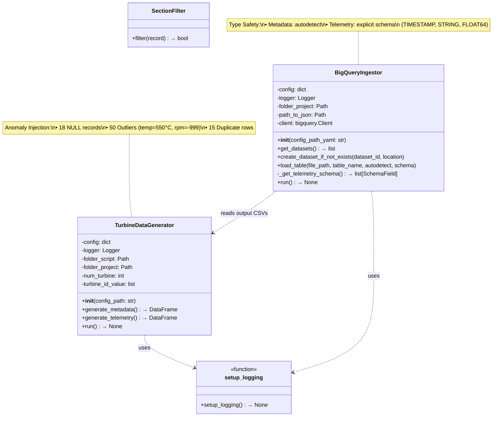
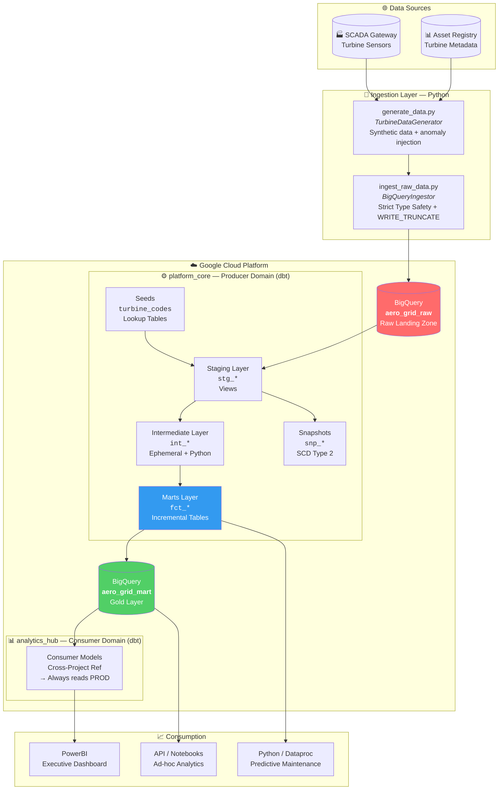
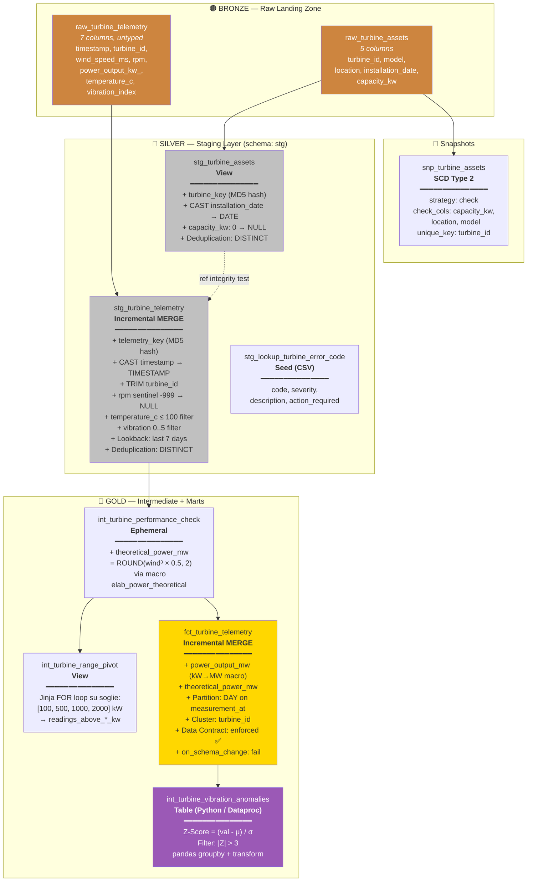
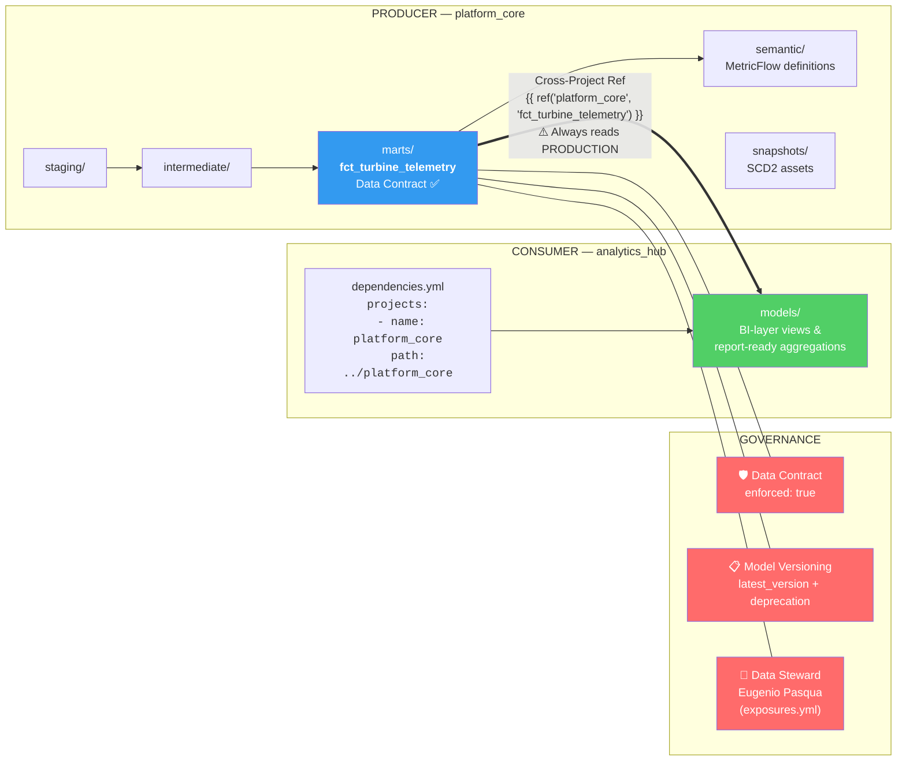
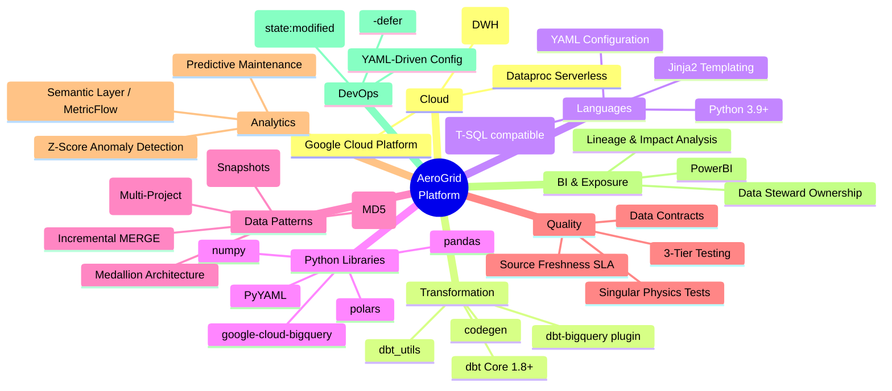

 
# 🌬️ AeroGrid Platform: Enterprise IoT Data Architecture

<p align="center">
  
  
  
  
  
  
</p>

**AeroGrid Platform** è un'infrastruttura dati Enterprise end-to-end progettata per l'ingestion, l'elaborazione e l'analisi avanzata di dati telemetrici IoT provenienti da una flotta di turbine eoliche. 

Sviluppato per simulare scenari reali ad alta intensità di dati (tipici del settore Energy/Aerospace), il progetto trasforma terabyte di rilevazioni grezze e non strutturate in Data Products certificati, pronti per la Business Intelligence e algoritmi di Predictive Maintenance.


---

## 🎯 Executive Summary & Valore di Business
Il progetto affronta e risolve le sfide critiche dell'ingegneria dei dati moderna per scenari ad alta intensità, posizionandosi come una soluzione "Enterprise-Ready". L'architettura implementa le best practice e gli standard ufficiali dbt Labs, strutturandosi su 4 pilastri strategici:

### 🏛️ 1. Architettura e Governance
* **Data Mesh & Domain-Driven Design (Multi-Project):** Suddivisione in due progetti dbt distinti e interdipendenti per evitare colli di bottiglia organizzativi. `platform_core` (Producer) è gestito dal team Data Engineering per le trasformazioni core; `analytics_hub` (Consumer) è dedicato alla BI. Una macro custom forza l'ambiente consumer a interrogare sempre la produzione reale, garantendo il disaccoppiamento senza duplicazione dei dati.
* **Architettura Medallion & Time Spine:** Strutturazione rigorosa in layer Staging (normalizzazione), Intermediate (logiche di business) e Marts (Gold Layer). Include l'implementazione di una Time Spine ininterrotta (2020-2030) vitale per gestire i tipici "buchi" di trasmissione dell'IoT e supportare aggregazioni temporali perfette.

### 🛡️ 2. Resilienza e Data Quality Industriale
* **Gestione 'Late Arriving Data' (Self-Healing):** Gestione automatica dei ritardi di rete IoT tramite pattern di UPSERT. I modelli incrementali sfruttano la strategia merge e chiavi Hash MD5 (surrogate keys) per accodare i nuovi pacchetti e sovrascrivere eventuali ritrasmissioni, annullando il rischio di duplicati.
* **Data Contracts & Model Versioning:** Il data product principale è blindato da rigidi Data Contracts (`enforced: true`) che impediscono modifiche distruttive allo schema. Le evoluzioni sono gestite tramite Model Versioning nativo, mantenendo le vecchie versioni operative (con `deprecation_date`) per garantire migrazioni a zero-downtime per i team a valle.
* **Quality Assurance a 3 Livelli & Fisica dei Dati:** Oltre ai test relazionali e ai limiti parametrici, il progetto implementa Singular Tests SQL che validano vere e proprie leggi fisiche industriali (es. impossibilità di generare energia in assenza di vento), isolando immediatamente anomalie hardware sfuggite ai sensori.
* **Source Freshness & SLA Monitoring:** Controlli rigorosi sulle fonti grezze per monitorare la latenza. In ambito eolico, intercettare oltre 24h di mancata trasmissione trasforma la pipeline dati in un sistema di allerta operativa precoce contro guasti ai gateway SCADA.

### 💡 3. Advanced Analytics & Astrazione
* **Polyglot Transformation (dbt-Python per Manutenzione Predittiva):** I calcoli procedurali statistici complessi non vengono forzati in SQL. Il progetto esegue nativamente nel DWH modelli Python (pandas via Dataproc) per l'individuazione di anomalie vibrazionali tramite Z-Score, fornendo dati pronti per interventi di manutenzione predittiva.
* **Semantic Layer & MetricFlow:** Astrazione totale delle logiche di business dal codice fisico. I KPI (come la Potenza Media per Turbina, calcolata dinamicamente come ratio) sono definiti centralmente in YAML, creando una vera "Single Source of Truth" interrogabile da qualsiasi tool BI.
* **Data Lineage Esteso & Exposures:** Il Lineage Graph (DAG) si estende oltre il DWH fino ai tool applicativi (es. dashboard direzionali PowerBI), abilitando una Impact Analysis istantanea e indicando chiaramente l'ownership dei Data Steward.

### ⚙️ 4. Scalabilità ed Efficienza (FinOps & DevOps)
* **Ottimizzazione Costi BigQuery (FinOps):** Architettura progettata per abbattere i costi di I/O. L'uso combinato di partizionamento temporale (`partition_by`), clustering, modelli incrementali e filtri dinamici di lookback in staging azzera i "full-table scan", massimizzando il Partition Pruning.
* **Storicizzazione Asset (SCD Type 2):** Tracciamento automatico del ciclo di vita fisico dell'hardware tramite i dbt Snapshots. Spostamenti o revamping delle turbine non alterano retroattivamente i KPI passati, garantendo un audit trail energetico immutabile.
* **Metaprogrammazione Jinja (DRY):** Utilizzo di macro e costrutti for-loop dinamici per automatizzare aggregazioni complesse (come i range di potenza pivotati), riducendo drasticamente il debito tecnico e accelerando il time-to-market di nuove feature.
* **DevOps, Slim CI & Deferral:** Pipeline ottimizzate che sfruttano il confronto di stato (`manifest.json`) e il deferral (`--defer`) per elaborare e testare esclusivamente i modelli modificati durante le Pull Request, importando i nodi genitore dalla produzione per una CI velocissima ed economica.

 <br><br>


## 🏗️ Architettura e Stack Tecnologico
L'architettura si divide in tre macro-moduli, separati fisicamente per supportare pipeline CI/CD indipendenti:

* **Python Data Ingestion (`data_ops_ingestion`):** Modulo ad oggetti per la simulazione e l'ingestion dei dati sensoriali. Implementa logiche di Strict Type Safety verso BigQuery e inietta volontariamente anomalie (valori nulli, outlier termici) per testare la resilienza della pipeline a valle.


<br><br>
* **Producer Domain (`platform_core`):** Progetto dbt Core dedicato al Data Engineering puro. Mappa le fonti, sanifica i dati, storicizza le anagrafiche (SCD2) e applica complessi modelli fisico-matematici.
* **Consumer Domain (`analytics_hub`):** Progetto dbt Core per la Business Intelligence. Importa i dati dal layer core tramite le logiche di Cross-Project References tipiche del Data Mesh, ignorando gli ambienti di dev e puntando direttamente alla produzione.

 

<br><br>

## <p align="center"> 🏗️ High-Level Focus Architecture </p>

L'architettura end-to-end segue un flusso lineare dai sensori SCADA (Supervisory Control And Data Acquisition) fino alla BI. I dati grezzi vengono generati e caricati su BigQuery dal modulo Python, attraversano i tre layer dbt del Producer Domain (Staging → Intermediate → Marts), e raggiungono il Consumer Domain che li espone a PowerBI, modelli predittivi e notebook di analisi. Ogni macro-modulo è fisicamente separato per consentire pipeline CI/CD indipendenti.
<br><br>



 

<br><br>

## <p align="center">  🥇 Medallion Architecture — Layer Detail </p>

I dati attraversano tre layer progressivi di raffinamento. Il Bronze (Raw Landing Zone) contiene i dati grezzi e non tipizzati così come arrivano dai sensori. Il Silver (Staging) applica hashing, deduplicazione, type casting e filtri di plausibilità. Il Gold (Intermediate + Marts) calcola la potenza teorica tramite macro fisiche, esegue l'anomaly detection in Python e produce la fact table certificata con Data Contract, partizionamento e clustering ottimizzati per BigQuery.

<br><br>



 

<br><br>

## <p align="center">  🔀 Data Mesh & Governance — Multi-Project Topology </p>

La separazione Producer/Consumer implementa i principi del Data Mesh. Il progetto platform_core possiede e governa i dati end-to-end fino al Mart certificato, blindato da Data Contract e Model Versioning. Il progetto analytics_hub consuma i dati esclusivamente via Cross-Project Reference, forzato a leggere sempre dalla produzione reale. L'ownership è tracciata tramite Exposures che collegano i modelli dbt agli asset applicativi esterni come le dashboard PowerBI.

<br><br>




<br><br>

## ✨ Enterprise Features Implementate
Questo repository è stato sviluppato seguendo rigorosamente gli standard ufficiali di dbt Labs e validato tramite il pacchetto `dbt_project_evaluator`.

* 🛡️ **Data Contracts & Versioning:** La fact table principale è blindata tramite contract: `enforced: true`. Evoluzioni strutturali sono gestite tramite `latest_version` e politiche di deprecazione programmate, garantendo zero disservizi per gli analisti BI.
* 🐍 **Polyglot Data Transformation (dbt-Python):** I calcoli procedurali complessi (come lo Z-Score per la rilevazione delle anomalie vibrazionali) non sono forzati in SQL, ma eseguiti nativamente nel DWH sfruttando modelli Python integrati nel DAG (via Dataproc Serverless).
* ⚙️ **Slim CI & Deferral:** Predisposizione per l'automazione DevOps tramite i flag `--state` e `--defer`, processando in CI solo il codice alterato durante le Pull Request, importando i nodi genitore direttamente dalla produzione.
* 📏 **Semantic Layer (MetricFlow):** Astrazione delle logiche aggregative dal codice SQL fisico. Metriche complesse (es. potenze medie e ratio) sono definite in YAML (`turbine_metrics.yml`), garantendo una singola "Source of Truth" per l'azienda.
* 🧪 **Advanced Data Quality (Data Physics):** Oltre ai test relazionali e ai bound parametrici (`dbt_utils.accepted_range`), il progetto include test SQL singolari per validare veri e propri principi fisici (es. impossibilità di generare energia in assenza di vento).

<br><br>

## 📂 Struttura del Repository (Monorepo)

```text
aero-grid-platform/
├── data_ops_ingestion/          # ELT Ingestion Engine (Python/Pandas/GCP)
│   ├── config/                  
│   ├── src/                     
│   └── utils/                   
├── platform_core/               # PRODUCER: Core Data Engineering (dbt)
│   ├── macros/                  # Jinja utils & Dynamic Schema override
│   ├── models/
│   │   ├── staging/             # Hashing, standardizzazione e SLA monitor
│   │   ├── intermediate/        # Ephemeral views, Python Models, Jinja loops
│   │   ├── marts/               # Modelli Incrementali versionati (Gold Layer)
│   │   └── semantic/            # Definizione del layer semantico
│   ├── snapshots/               # SCD Type 2 per gli asset fisici
│   └── tests/                   # Singular tests sulla fisica dei dati
└── analytics_hub/               # CONSUMER: Business Intelligence (dbt)
    ├── dependencies.yml         # Puntamento locale a platform_core
    └── models/                  

```

<br><br>


## 🧰 Technology Stack Summary


<br><br>  

### Stack Dettagliato

| Layer | Technology | Role | Version |
|:------|:-----------|:-----|:--------|
| ☁️ **Cloud** | Google Cloud Platform | Infrastructure & IAM | — |
| | BigQuery | Columnar DWH (Partitioned + Clustered) | — |
| | Dataproc Serverless | Python model runtime in-DWH | — |
| ⚙️ **Transformation** | dbt Core | Orchestration, DAG, Testing | 1.8+ |
| | dbt-bigquery | BigQuery adapter (MERGE, partitioning) | latest |
| | dbt_utils | `surrogate_key`, `accepted_range`, `date_spine` | 1.3.3 |
| | codegen | Model & source scaffolding | 0.14.0 |
| 💻 **Languages** | SQL | Core transformations & CTE chains | BigQuery SQL |
| | Python 3.9+ | Ingestion engine & dbt-Python models | 3.9+ |
| | Jinja2 | Macros, DRY loops, dynamic SQL | native dbt |
| | YAML | Contracts, configs, semantic definitions | — |
| 🐍 **Python Libs** | pandas | Z-Score anomaly detection, transforms | — |
| | numpy | Statistical data generation (seeds) | — |
| | polars | High-performance data processing | — |
| | google-cloud-bigquery | BigQuery API ingestion client | — |
| | PyYAML | YAML-driven configuration | — |
| 🧩 **Patterns** | Medallion Architecture | Bronze → Silver → Gold layer separation | — |
| | Data Mesh | Producer/Consumer multi-project domains | — |
| | SCD Type 2 | dbt Snapshots for asset historization | — |
| | Incremental MERGE | Self-healing upsert with MD5 surrogate keys | — |
| 🛡️ **Quality** | Data Contracts | `enforced: true` + `on_schema_change: fail` | — |
| | Source Freshness | SLA monitoring (warn 12h / error 24h) | — |
| | 3-Tier Testing | Schema → Parametric bounds → Physics laws | — |
| 📊 **Analytics** | Semantic Layer | MetricFlow KPI definitions in YAML | — |
| | Z-Score Detection | Vibrational anomaly outlier isolation | — |
| | PowerBI | Executive dashboard (Exposure mapped) | — |
| 🚀 **DevOps** | Slim CI | `--select state:modified+` on PR only | — |
| | Deferral | `--defer` reads parent nodes from production | — |
| | FinOps | Partition pruning + clustering + ephemeral CTE | — |

 <br><br><br>


## 🚀 Getting Started

### Prerequisiti

* Python 3.9+
* dbt-core 1.8+ e plugin `dbt-bigquery`
* Credenziali attive per Google Cloud Platform (BigQuery)

### Setup Ambiente

**1. Configurazione Profilo (`profiles.yml`)**
Configura il file `~/.dbt/profiles.yml` puntando al tuo progetto Google Cloud.

**2. Esecuzione Ingestion**
Simula la generazione e il caricamento dei dati telemetrici grezzi:

```bash
cd data_ops_ingestion
python src/ingest_raw_data.py

```

**3. Build della Data Platform (Platform Core)**
Installa le dipendenze ed esegui l'intera pipeline di trasformazione e validazione:

```bash
cd ../platform_core
dbt deps
dbt build

```

*(Il comando `build` concatenerà automaticamente run, test, snapshot e validazione seed).*

**4. Esplorazione tramite Analytics Hub**
Per simulare il lavoro del team BI che accede ai dati governati:

```bash
cd ../analytics_hub
dbt deps
dbt run

```

<br><br>

*Progettato e sviluppato da Eugenio Pasqua.*


<br><br><br><br><br>

---

<br><br>


 

# 🇬🇧 ENGLISH VERSION

# 🌬️ AeroGrid Platform: Enterprise IoT Data Architecture

<p align="center">
  
  
  
  
  
  
</p>

**AeroGrid Platform** is an end-to-end Enterprise data infrastructure designed for the ingestion, processing, and advanced analysis of IoT telemetry data from a fleet of wind turbines.

Built to simulate data-intensive, real-world scenarios (typical of the Energy/Aerospace sectors), the project transforms terabytes of raw, unstructured sensor readings into certified Data Products, ready for Business Intelligence and Predictive Maintenance algorithms.


---

## 🎯 Executive Summary & Business Value
The project tackles and resolves the critical challenges of modern data engineering for high-intensity scenarios, positioning itself as an "Enterprise-Ready" solution. The architecture implements best practices and official dbt Labs standards, structured around 4 strategic pillars:

### 🏛️ 1. Architecture & Governance
* **Data Mesh & Domain-Driven Design (Multi-Project):** Split into two distinct and interdependent dbt projects to avoid organizational bottlenecks. `platform_core` (Producer) is managed by the Data Engineering team for core transformations; `analytics_hub` (Consumer) is dedicated to BI. A custom macro forces the consumer environment to always query actual production data, ensuring decoupling without data duplication.
* **Medallion Architecture & Time Spine:** Rigorously structured into Staging (normalization), Intermediate (business logic), and Marts (Gold Layer) layers. Includes the implementation of an unbroken Time Spine (2020-2030), vital for handling typical IoT transmission "gaps" and supporting flawless time-based aggregations.

### 🛡️ 2. Resilience & Industrial Data Quality
* **Late Arriving Data Management (Self-Healing):** Automatic handling of IoT network delays via UPSERT patterns. Incremental models leverage the merge strategy and MD5 Hash keys (surrogate keys) to append new packets and overwrite any retransmissions, eliminating the risk of duplicates.
* **Data Contracts & Model Versioning:** The primary data product is secured by strict Data Contracts (`enforced: true`) that prevent destructive schema modifications. Evolutions are managed via native Model Versioning, keeping older versions operational (with `deprecation_date`) to guarantee zero-downtime migrations for downstream teams.
* **3-Tier Quality Assurance & Data Physics:** Beyond relational tests and parametric bounds, the project implements SQL Singular Tests that validate actual physical industrial laws (e.g., the impossibility of generating power with zero wind), immediately isolating hardware anomalies missed by sensors.
* **Source Freshness & SLA Monitoring:** Strict checks on raw sources to monitor latency. In the wind energy sector, intercepting over 24h of missing transmissions turns the data pipeline into an early operational warning system against SCADA gateway failures.

### 💡 3. Advanced Analytics & Abstraction
* **Polyglot Transformation (dbt-Python for Predictive Maintenance):** Complex procedural statistical calculations are not forced into SQL. The project natively executes Python models (pandas via Dataproc) within the DWH to detect vibrational anomalies using Z-Scores, delivering data ready for predictive maintenance interventions.
* **Semantic Layer & MetricFlow:** Total abstraction of business logic from physical code. KPIs (like Average Power per Turbine, dynamically calculated as a ratio) are centrally defined in YAML, creating a true "Single Source of Truth" queryable by any BI tool.
* **Extended Data Lineage & Exposures:** The Lineage Graph (DAG) extends beyond the DWH to application tools (e.g., PowerBI executive dashboards), enabling instant Impact Analysis and clearly indicating Data Steward ownership.

### ⚙️ 4. Scalability & Efficiency (FinOps & DevOps)
* **BigQuery Cost Optimization (FinOps):** Architecture designed to slash I/O costs. The combined use of time partitioning (`partition_by`), clustering, incremental models, and dynamic lookback filters in staging eliminates full-table scans, maximizing Partition Pruning.
* **Asset Historization (SCD Type 2):** Automatic tracking of hardware's physical lifecycle via dbt Snapshots. Relocations or revamping of turbines do not retroactively alter past KPIs, ensuring an immutable energy audit trail.
* **Jinja Metaprogramming (DRY):** Use of macros and dynamic for-loop constructs to automate complex aggregations (like pivoted power ranges), drastically reducing technical debt and accelerating the time-to-market for new features.
* **DevOps, Slim CI & Deferral:** Optimized pipelines leveraging state comparison (`manifest.json`) and deferral (`--defer`) to process and test exclusively the models modified during Pull Requests, importing parent nodes from production for lightning-fast and cost-effective CI.

 <br><br>


## 🏗️ Architecture & Technology Stack
The architecture is divided into three macro-modules, physically separated to support independent CI/CD pipelines:

* **Python Data Ingestion (`data_ops_ingestion`):** Object-oriented module for the simulation and ingestion of sensor data. Implements Strict Type Safety logic towards BigQuery and intentionally injects anomalies (null values, thermal outliers) to test downstream pipeline resilience.


<br><br>
* **Producer Domain (`platform_core`):** dbt Core project dedicated to pure Data Engineering. Maps sources, sanitizes data, historizes master data (SCD2), and applies complex physical-mathematical models.
* **Consumer Domain (`analytics_hub`):** dbt Core project for Business Intelligence. Imports data from the core layer via Cross-Project References typical of Data Mesh logic, ignoring dev environments and pointing directly to production.

 

<br><br>

## <p align="center"> 🏗️ High-Level Architecture Focus </p>

The end-to-end architecture follows a linear flow from SCADA (Supervisory Control And Data Acquisition) sensors to BI. Raw data is generated and loaded into BigQuery by the Python module, flows through the three dbt layers of the Producer Domain (Staging → Intermediate → Marts), and reaches the Consumer Domain which exposes it to PowerBI, predictive models, and analytics notebooks. Each macro-module is physically separated to enable independent CI/CD pipelines.

<br><br>


 

<br><br>

## <p align="center">  🥇 Medallion Architecture — Layer Detail </p>

Data flows through three progressive refinement layers. The Bronze (Raw Landing Zone) contains raw, untyped data as it arrives from sensors. The Silver (Staging) applies hashing, deduplication, type casting, and plausibility filters. The Gold (Intermediate + Marts) computes theoretical power via physics macros, runs anomaly detection in Python, and produces the certified fact table with Data Contract, partitioning, and clustering optimized for BigQuery.

<br><br>


 

<br><br>

## <p align="center">  🔀 Data Mesh & Governance — Multi-Project Topology </p>

The Producer/Consumer separation implements Data Mesh principles. The platform_core project owns and governs data end-to-end up to the certified Mart, secured by Data Contracts and Model Versioning. The analytics_hub project consumes data exclusively via Cross-Project References, forced to always read from actual production. Ownership is tracked through Exposures that link dbt models to external application assets such as PowerBI dashboards.
<br><br>


<br><br>

## ✨ Enterprise Features Implemented
This repository was developed strictly adhering to official dbt Labs standards and validated using the `dbt_project_evaluator` package.

* 🛡️ **Data Contracts & Versioning:** The main fact table is secured via contract: `enforced: true`. Structural changes are managed via `latest_version` and scheduled deprecation policies, ensuring zero disruption for BI analysts.
* 🐍 **Polyglot Data Transformation (dbt-Python):** Complex procedural calculations (such as Z-Score for vibrational anomaly detection) are not forced into SQL, but executed natively in the DWH leveraging Python models integrated into the DAG (via Dataproc Serverless).
* ⚙️ **Slim CI & Deferral:** Ready for DevOps automation via `--state` and `--defer` flags, processing only altered code during Pull Requests, importing parent nodes directly from production.
* 📏 **Semantic Layer (MetricFlow):** Aggregation logic abstracted from physical SQL code. Complex metrics (e.g., average power and ratios) are defined in YAML (`turbine_metrics.yml`), ensuring a single "Source of Truth" for the organization.
* 🧪 **Advanced Data Quality (Data Physics):** Beyond relational tests and parametric bounds (`dbt_utils.accepted_range`), the project includes singular SQL tests to validate actual physical principles (e.g., the impossibility of generating power with zero wind).

<br><br>

## 📂 Repository Structure (Monorepo)

```text
aero-grid-platform/
├── data_ops_ingestion/          # ELT Ingestion Engine (Python/Pandas/GCP)
│   ├── config/                  
│   ├── src/                     
│   └── utils/                   
├── platform_core/               # PRODUCER: Core Data Engineering (dbt)
│   ├── macros/                  # Jinja utils & Dynamic Schema override
│   ├── models/
│   │   ├── staging/             # Hashing, standardization & SLA monitor
│   │   ├── intermediate/        # Ephemeral views, Python Models, Jinja loops
│   │   ├── marts/               # Versioned Incremental Models (Gold Layer)
│   │   └── semantic/            # Semantic layer definition
│   ├── snapshots/               # SCD Type 2 for physical assets
│   └── tests/                   # Singular tests on data physics
└── analytics_hub/               # CONSUMER: Business Intelligence (dbt)
    ├── dependencies.yml         # Local pointing to platform_core
    └── models/                  

```

<br><br>


## 🧰 Technology Stack Summary


<br><br>  

### Detailed Stack

| Layer | Technology | Role | Version |
|:------|:-----------|:-----|:--------|
| ☁️ **Cloud** | Google Cloud Platform | Infrastructure & IAM | — |
| | BigQuery | Columnar DWH (Partitioned + Clustered) | — |
| | Dataproc Serverless | Python model runtime in-DWH | — |
| ⚙️ **Transformation** | dbt Core | Orchestration, DAG, Testing | 1.8+ |
| | dbt-bigquery | BigQuery adapter (MERGE, partitioning) | latest |
| | dbt_utils | `surrogate_key`, `accepted_range`, `date_spine` | 1.3.3 |
| | codegen | Model & source scaffolding | 0.14.0 |
| 💻 **Languages** | SQL | Core transformations & CTE chains | BigQuery SQL |
| | Python 3.9+ | Ingestion engine & dbt-Python models | 3.9+ |
| | Jinja2 | Macros, DRY loops, dynamic SQL | native dbt |
| | YAML | Contracts, configs, semantic definitions | — |
| 🐍 **Python Libs** | pandas | Z-Score anomaly detection, transforms | — |
| | numpy | Statistical data generation (seeds) | — |
| | polars | High-performance data processing | — |
| | google-cloud-bigquery | BigQuery API ingestion client | — |
| | PyYAML | YAML-driven configuration | — |
| 🧩 **Patterns** | Medallion Architecture | Bronze → Silver → Gold layer separation | — |
| | Data Mesh | Producer/Consumer multi-project domains | — |
| | SCD Type 2 | dbt Snapshots for asset historization | — |
| | Incremental MERGE | Self-healing upsert with MD5 surrogate keys | — |
| 🛡️ **Quality** | Data Contracts | `enforced: true` + `on_schema_change: fail` | — |
| | Source Freshness | SLA monitoring (warn 12h / error 24h) | — |
| | 3-Tier Testing | Schema → Parametric bounds → Physics laws | — |
| 📊 **Analytics** | Semantic Layer | MetricFlow KPI definitions in YAML | — |
| | Z-Score Detection | Vibrational anomaly outlier isolation | — |
| | PowerBI | Executive dashboard (Exposure mapped) | — |
| 🚀 **DevOps** | Slim CI | `--select state:modified+` on PR only | — |
| | Deferral | `--defer` reads parent nodes from production | — |
| | FinOps | Partition pruning + clustering + ephemeral CTE | — |

 <br><br><br>


## 🚀 Getting Started

### Prerequisites

* Python 3.9+
* dbt-core 1.8+ and `dbt-bigquery` plugin
* Active Google Cloud Platform (BigQuery) credentials

### Environment Setup

**1. Profile Configuration (`profiles.yml`)**
Configure the `~/.dbt/profiles.yml` file pointing to your Google Cloud project.

**2. Run Ingestion**
Simulate the generation and loading of raw telemetry data:

```bash
cd data_ops_ingestion
python src/ingest_raw_data.py

```

**3. Build the Data Platform (Platform Core)**
Install dependencies and execute the entire transformation and validation pipeline:

```bash
cd ../platform_core
dbt deps
dbt build

```

*(The `build` command will automatically concatenate run, test, snapshot, and seed validation).*

**4. Explore via Analytics Hub**
To simulate the BI team's workflow accessing governed data:

```bash
cd ../analytics_hub
dbt deps
dbt run

```

---

*Designed and developed by Eugenio Pasqua.*
